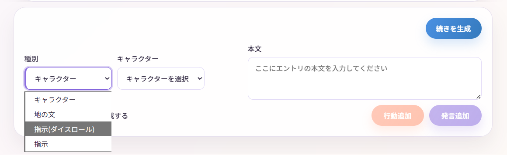
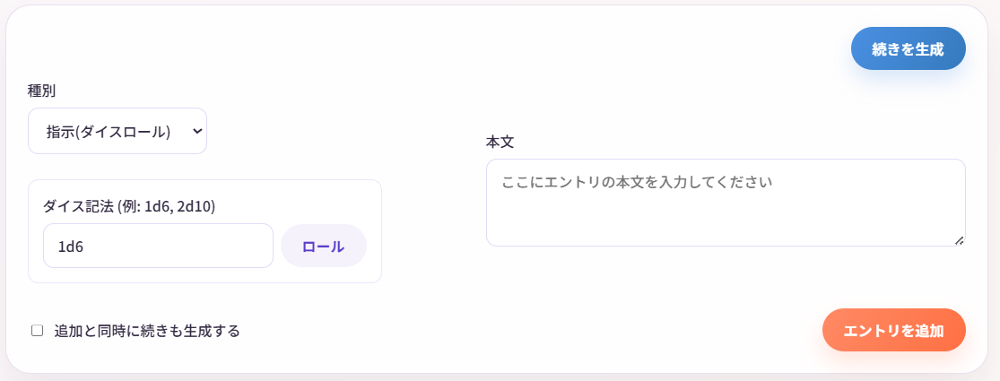
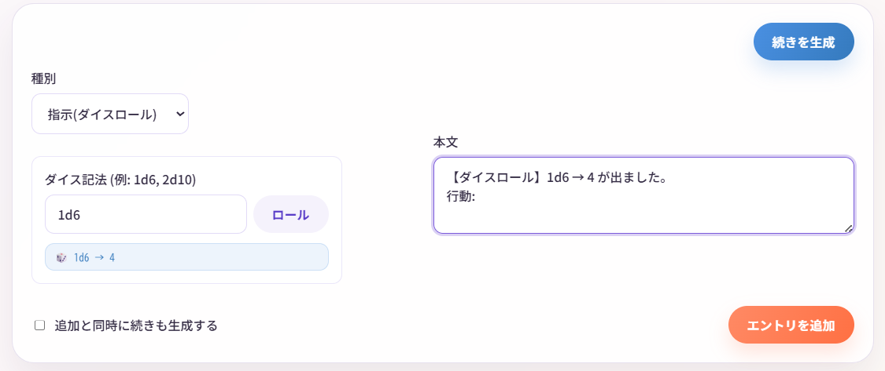

# ダイスロール機能

Narrative Conversationには、**ダイスロール機能**が搭載されています。  
TRPG風に運要素を取り入れて、物語を楽しむことができます。

## ダイスロールとは？

**ダイスロール**は、サイコロを振って出た目で行動の成否を決める、TRPGでおなじみのシステムです。

例えば：
- 「魔法が成功するかどうか、1d20で判定」
- 「敵の攻撃をかわせるか、2d6で判定」

このように、ランダム要素を物語に取り入れることができます。

AIゲームマスターをさせている時にダイスロールを使うと、よりTRPGらしい体験ができます。

---

## 基本的な使い方

### ステップ1: ダイスロールエントリを追加

1. 画面右下の種別から **「指示(ダイスロール)」** を選択



2. **ダイスロール画面**が表示されます

### ステップ2: ダイス記法を入力

ダイス記法を入力します。



**例：**
- `1d6` - 6面サイコロを1つ振る
- `2d10` - 10面サイコロを2つ振る
- `3d20` - 20面サイコロを3つ振る

### ステップ3: 実行

**「ロール」** ボタンをクリックすると、結果が指示の本文に追加されます。

**例：**
```
【ダイスロール】2d6 → [1, 6] = 7 が出ました。
行動: 
```

編集したあと、 **「エントリを追加」** ボタンをクリックしてエントリを保存します。  

!!! tip "ダイスロールはエントリとして保存される"
    ダイスロールの結果は、他のエントリと同様に保存されます。後から編集・削除も可能です。
    何度も振るとどんどん追記されていきます。  
    追加する前に書き換えたり、何度も振り直すことも可能です。



---

## TRPG風に遊ぶ

Narrative Conversationを、一人TRPGのように遊ぶこともできます。

**システムプロンプト**

```
あなたはTRPGのゲームマスター（GM）です。
プレイヤーの行動に対して、状況を描写してください。
判定としてダイスロールを要求してください。
ダイスロールの結果に基づいて、行動の成否を判定してください。

ユーザーが提供するキャラクターの名前、性格、設定に基づいて、魅力的な物語を作成してください。
物語は短い地の文と対話の形式で進行します。

世界観やキャラクター情報を参照し、魅力的なゲームを進行してください。

GMは、物語とアリス(NPC)を担当します。
プレイヤー(PC)は「ボブ」です。
```

**司令**

ゲーム進行だけをしたい場合は

```
次にダイスロールが必要な場面まで進行してください。
```

ロールプレイを楽しみたい場合は

```
次の場面まで進行し、アリス(NPC)の発言をしてください。ボブ(PC)の発言はユーザーが入力します。
```

※ロールプレイ中も、指示で「GM、キャロルに何が起きたのかを説明してもらえますか？」と入れると代わりに進行してくれたりします。

---

## よくある質問

### Q. AIがダイス結果を無視します

**A.** 以下を試してください：

1. 司令やシステムプロンプトで明示的に「ダイスロールの結果を反映してください」と指示
2. ダイスロールの直後に「指示」エントリで結果を説明
3. システムプロンプトに「ダイスロールを尊重してください」と追加

### Q. もっと複雑なダイスロールはできませんか？

**A.** 現在は `NdM` 形式のみ対応しています。

`2d6+3`（修正値付き）などは、手動で計算してください。

### Q. ダイスロールなしで遊ぶことはできますか？

**A.** もちろんです！

ダイスロールはオプション機能なので、使わなくても問題ありません。

---

## まとめ

ダイスロール機能を使うと：

-  運要素を取り入れて、物語が予測不能に
-  TRPG風の遊び方ができる
-  判定システムで、物語にメリハリが生まれる

慣れてきたら、独自のルールを作って楽しむのもおすすめです！ 

---

## 次のステップ

- [物語の編集と分岐](editing-branching.md) - より高度な物語の操作
- [エクスポート機能](export.md) - 完成した物語を保存・共有
