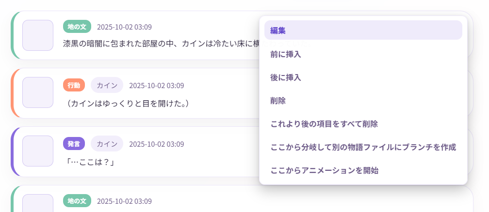
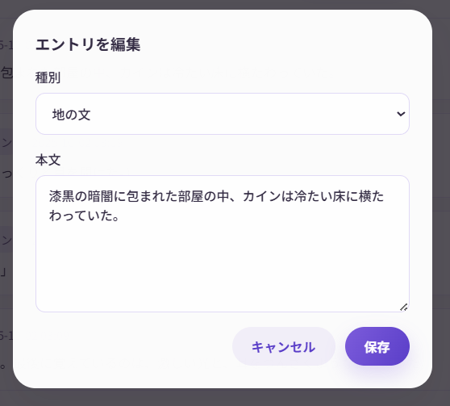
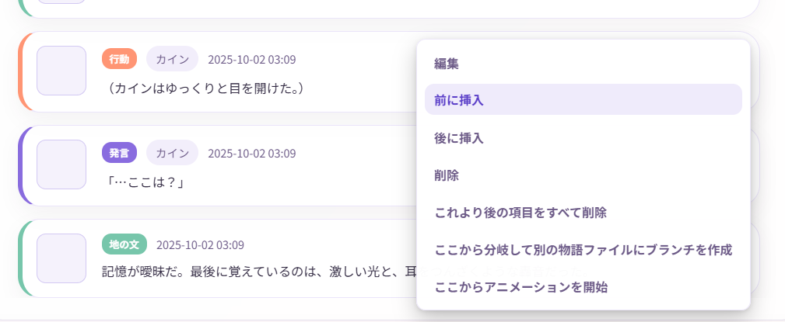

# 物語の編集と分岐

Narrative Conversationの最大の特徴は、**物語を自由に編集・分岐できること**です。このページでは、高度な編集テクニックを紹介します。

## 物語編集の基本

通常のAIチャットと違い、Narrative Conversationでは過去の内容を自由に編集できます。

### できること

-  過去のエントリを編集
-  不要なエントリを削除
-  途中にエントリを挿入
-  物語を分岐させる

---

## エントリの編集

### 編集方法

1. タイムライン上のエントリをクリック
2. 内容を修正
3. **「保存」** をクリック





### 編集例

**元のエントリ：**
```
アリス: やった! 魔法が成功したよ！
```

**編集後：**
```
アリス: やった！火の魔法がこんなに強力だなんて！
```

!!! tip "自動保存"
    編集すると、数秒後に自動的に保存されます。

---

## エントリの削除

### 削除方法

1. 削除したいエントリをクリック
2. **「削除」** ボタンをクリック
3. 確認ダイアログで **「削除」**

### 削除の使い道

- AIが変な展開にしてしまった
- 誤字脱字を含むエントリを削除したい
- 物語の方向性を変えたい

!!! warning "削除は元に戻せません"
    一度削除すると復元できません。慎重に操作してください。

---

## エントリの挿入

### 挿入方法

1. 挿入したい位置の**直前または直後のエントリ**をクリック
2. **「前に挿入」** または **「後に挿入」** を選択
3. 新しいエントリの内容を入力
4. **「追加」** をクリック



### 挿入の使い道

- 説明不足な部分に地の文を追加
- キャラクターのリアクションを追加
- 伏線を後から挿入

**例：**

```
【元の物語】
エントリ1: アリスが教室に入った
エントリ2: 先生が授業を始めた

【挿入後】
エントリ1: アリスが教室に入った
エントリ1.5: ボブがアリスに手を振った ← 挿入！
エントリ2: 先生が授業を始めた
```

---

## 物語の分岐

**分岐**は、Narrative Conversationの最もパワフルな機能です。

### 分岐とは？

物語の途中から、**別の展開**を試すことができます。

```
        ┌─ 分岐A: アリスが魔法に成功
共通部分 ┤
        └─ 分岐B: アリスが魔法に失敗
```

複数の「if」を試して、好きな展開を選べます。

### 分岐の作り方

1. 分岐したいエントリをクリック
2. **「ここから分岐して別の物語ファイルにブランチを作成」** ボタンをクリック
3. 分岐を作成ダイアログで タイトルや説明を入れて**「分岐を作成」**

**例：**

```
【元の展開】
1. アリスが魔法を唱える
2. 魔法が成功した
3. 敵が倒れた

【分岐を作る】
1. アリスが魔法を唱える
（ここから分岐）

2. 司令で「魔法が失敗して、爆発が起こる展開にしてください」と指示
3. 生成
```

---

## 複数バージョンの管理

同じ物語で複数の展開を試したい場合、**物語ファイルを複製**します。

### 物語の複製方法

1. 最後のエントリをクリック
2. **「ここから分岐して別の物語ファイルにブランチを作成」** ボタンをクリック
3. 分岐を作成ダイアログで タイトルや説明を入れて**「分岐を作成」**

これで、元の物語を残したまま、別バージョンに複製・分岐させることができます。

---

## 高度なテクニック

### テクニック1: タイムリープ

過去に戻って、別の選択をする。

1. 戻りたい時点までのエントリを残す
2. それ以降を削除
3. 別の展開を生成

### テクニック2: マルチエンディング

複数の結末を用意する。

1. クライマックス直前で物語を複製
2. それぞれで異なる結末を生成
3. 好きな結末を選ぶ、または全部保存

### テクニック3: キャラクター入れ替え

途中からキャラクターを変える。

1. キャラクターを無効化/有効化
2. 「指示」エントリで「○○が退場し、××が登場」と書く
3. 以降、新しいキャラクターで展開

### テクニック4: パラレルワールド

同じ開始点から、まったく異なる世界線を作る。

1. 序盤を複製
2. 片方は「世界観」を編集
3. それぞれで別の物語を展開

!!! tip "世界観の管理"
    ※世界観は共通ですが、世界観は履歴ボタンから前に使ったものを呼び出すことができます。  
    また、常時複数の世界観を展開したい場合は、世界観タブを空にして、指示や地の文に世界観を書くことでも代用できます。

---

## 編集のコツ

### 1. こまめにエクスポート

大きな編集をする前に、エクスポートや分岐でバックアップを取りましょう。

### 2. 司令で明示する

編集後にAI生成する時は、司令で編集内容を伝えましょう。

**例：**
```
先ほど、アリスの魔法が失敗したことに変更しました。
この展開で続きを書いてください。
```

### 3. 少しずつ編集

一度に大量に編集すると、物語の流れが不自然になることがあります。
少しずつ編集して、その都度AIに続きを生成させると良いでしょう。

### 4. 整合性をチェック

編集後、以下を確認：

- 時系列が矛盾していないか
- キャラクターの行動が自然か
- 前後の文脈が繋がっているか
