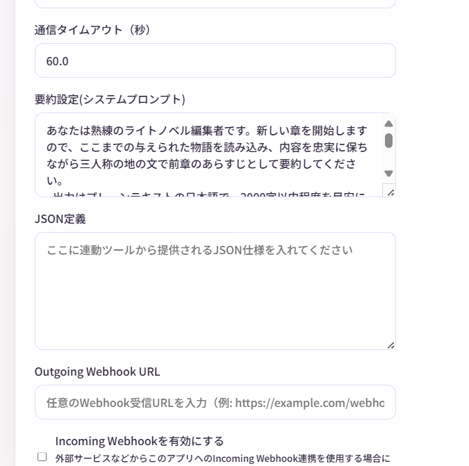

# JSON連動機能

**JSON連動機能**は、物語内にプログラムが読み取れるデータを埋め込み、外部ツールと連携する上級者向けの機能です。

!!! danger "非常に高度な機能"
    この機能は、以下の知識が必要です：
    
    - JSON形式の理解
    - プログラミング経験
    - Webhook連携の知識
    
    初心者の方は、まず基本機能をマスターしてください。

!!! danger "安全性に関する注意"
    外部ツールや外部機器の制御を伴うため、**安全性に十分注意してください。**

    - 信頼できるツールのみ使用してください。
    - 熱源や感電などの危険がある機器は特に注意してください。
    - 万が一の誤動作に備え、緊急停止手段を用意してください。

---

## JSON連動とは？

通常、物語は人間が読むためのテキストですが、**JSON連動機能**を使うと、プログラムが理解できるデータも一緒に生成できます。

### 例：照明制御

```xml
<narration>部屋が暗くなった。</narration>
<json>{"device": "light", "color": "blue", "brightness": 30}</json>
```

この`<json>`タグ内のデータを外部プログラムが読み取り、実際にスマートライトを青く暗くできます。

---

## 基本的な使い方

### ステップ1: JSON定義を設定

1. 上部メニューから **「設定」**
2. **「JSON定義」** 欄に、生成してほしいJSONの仕様を記述

**例（照明制御）：**
```
このJSONは、スマートライトを制御するために使用されます。

フィールド：
- device: 常に "light" を指定
- color: ライトの色（"red", "blue", "green", "white", "yellow"）
- brightness: 明るさ（0〜100の整数）

例：
{"device": "light", "color": "red", "brightness": 80}
{"device": "light", "color": "blue", "brightness": 30}
```



### ステップ2: 物語を生成

AIが物語を生成する際、アニメーションに合わせて、適切なタイミングでJSONも一緒に生成します。  

**生成例：**
```xml
<narration>太陽が沈み、部屋が暗くなった。</narration>
<json>{"device": "light", "color": "blue", "brightness": 30}</json>
<dialogue name="アリス">夜になったね。ライトをつけようか。</dialogue>
<json>{"device": "light", "color": "white", "brightness": 80}</json>
```

### ステップ3: JSONを外部ツールに送信

**Outgoing Webhook**を設定しておけば、JSONが自動的に外部ツールに送信されます。  
※キャラクター発言、地の文なども同様に外部送信されます。

送信されるデータ：
```json
{
  "type": "json",
  "name": null,
  "content": "{\"device\": \"light\", \"color\": \"blue\", \"brightness\": 30}",
  "createdAt": "2025-01-01T12:00:00Z",
  "storyId": "story-abc123"
}
```

!!! tips "送信はアニメーション再生時に毎回行われます"
    - 送信は、物語生成と、メニューからの手動アニメーション再生の両方で行われます。
    - 一通り生成し終わってから、Outgoing Webhookを設定してアニメーションを再生することでも送信されます。

---

## JSON定義の書き方

### 良い定義の例

#### 例1: 音楽再生

```
このJSONは、BGM再生を制御します。

フィールド：
- action: "play" または "stop"
- track: 曲名（"battle", "peaceful", "dramatic", "sad"）
- volume: 音量（0〜100）

例：
{"action": "play", "track": "battle", "volume": 70}
{"action": "stop"}
```

#### 例2: キャラクターの感情

```
このJSONは、キャラクターの感情状態を表します。

フィールド：
- character: キャラクター名
- emotion: 感情（"happy", "sad", "angry", "surprised", "neutral"）
- intensity: 強度（1〜10）

例：
{"character": "アリス", "emotion": "happy", "intensity": 8}
{"character": "ボブ", "emotion": "angry", "intensity": 5}
```

#### 例3: ゲーム変数

```
このJSONは、ゲームの内部変数を管理します。

フィールド：
- variable: 変数名
- value: 値（数値または文字列）
- operation: "set", "add", "subtract"

例：
{"variable": "hp", "value": 10, "operation": "subtract"}
{"variable": "score", "value": 100, "operation": "add"}
{"variable": "location", "value": "forest", "operation": "set"}
```

### 定義のコツ

1. **具体例を複数書く** - AIが理解しやすくなる
2. **フィールドを明確に** - 何を意味するか説明
3. **値の範囲を指定** - 0〜100など
4. **使用場面を説明** - いつ使うかAIに伝える

---

## 外部ツールの作成例

### Python + スマートライト

!!! warning "以下のコードは例示です。動作確認をしていません。"
    実際に使用する場合は、セキュリティやエラーハンドリングを十分に考慮してください。

```python
from flask import Flask, request
import requests

app = Flask(__name__)

@app.route('/webhook', methods=['POST'])
def webhook():
    data = request.json
    
    # JSONエントリのみ処理
    if data.get('type') == 'json':
        import json
        content = json.loads(data.get('content', '{}'))
        
        # スマートライト制御
        if content.get('device') == 'light':
            color = content.get('color')
            brightness = content.get('brightness')
            
            # ここで実際のライトを制御
            control_smart_light(color, brightness)
            print(f"ライトを {color} に設定、明るさ {brightness}")
    
    return {"status": "ok"}

def control_smart_light(color, brightness):
    # 実際のスマートライトAPIを呼び出す
    # 例: Philips Hue, LIFX など
    pass

if __name__ == '__main__':
    app.run(port=5000)
```

Narrative Conversationの設定で、Webhook URLを `http://127.0.0.1:5000/webhook` に設定します。

---

## 使用例

### 例1: BGM制御システム

**JSON定義：**
```
BGM再生を制御します。
- action: "play" または "stop"
- track: "battle", "peaceful", "dramatic", "sad"
- volume: 0〜100
```

**物語：**
```
<narration>突然、敵が現れた！</narration>
<json>{"action": "play", "track": "battle", "volume": 80}</json>
<dialogue name="アリス">来た！</dialogue>
```

**外部ツール:** 音楽プレイヤーがバトルBGMを再生

---

### 例2: ゲーム連動

**JSON定義：**
```
ゲーム内イベントを制御します。
- event: "damage", "heal", "item_get", "level_up"
- value: 数値
- target: キャラクター名
```

**物語：**
```
<action name="ボブ">剣で敵を斬りつけた</action>
<json>{"event": "damage", "value": 50, "target": "敵"}</json>
<narration>敵のHPが50減少した。</narration>
```

**外部ツール:** ゲームエンジンが敵のHPを減らす

---

### 例3: VTuber配信連動

**JSON定義：**
```
VTuberの表情を制御します。
- expression: "smile", "sad", "angry", "surprised", "neutral"
- duration: 表情の持続時間（秒）
```

**物語：**
```
<dialogue name="アリス">やった！成功したよ！</dialogue>
<json>{"expression": "smile", "duration": 3}</json>
```

**外部ツール:** Live2Dモデルが笑顔になる

---

## 注意事項

### JSONは物語の一部

- JSONエントリも物語のタイムラインに含まれ、表示されます。
- エクスポート時、XMLには含まれます。テキストには含まれません。

### AIの生成精度

AIが必ずしも完璧なJSONを生成するとは限りません。

- 外部ツール側でエラーハンドリングを行う
- JSON定義を具体的に書く
- 生成後に手動で修正することも可能

### パフォーマンス

JSONを頻繁に生成すると、トークン消費が増えます。

- 必要最小限にする
- 重要な場面でのみ使用

---

## トラブルシューティング

### AIがJSONを生成しない

**対処法：**

1. JSON定義を見直す（具体例を増やす）
2. 司令で明示的に指示（「適切なタイミングでJSONを生成してください」）
3. システムプロンプトに追記（「JSON連動を積極的に使ってください」）

### JSONの形式が正しくない

**対処法：**

1. 外部ツール側でJSONパースエラーをキャッチ
2. 無効なJSONは無視する
3. エントリを手動で修正

### 外部ツールが反応しない

**対処法：**

1. Outgoing Webhookが設定されているか確認
2. 外部ツールが起動しているか確認
3. ネットワーク接続を確認
4. ログを確認（外部ツール側、サーバー側）

---

## よくある質問

### Q. JSON定義は必須ですか？

**A.** いいえ、オプションです。

JSON連動を使わなくても、Narrative Conversationは使えます。

### Q. 複数のJSON定義を設定できますか？

**A.** 1つの定義内に、複数の用途を含めることは可能です。

```
【ライト制御】
{"device": "light", "color": "red", "brightness": 80}

【音楽制御】
{"device": "music", "action": "play", "track": "battle"}
```

### Q. JSONを手動で追加できますか？

**A.** はい、エントリタイプで「JSON」を選択して追加できます。

---

## まとめ

JSON連動機能を使えば：

-  物語と外部システムを連動
-  スマートホーム、ゲーム、VTuberなどと連携
-  物語がインタラクティブに

高度な機能ですが、創造性を大きく広げる可能性を秘めています！ 

---

## 次のステップ

- [Webhook連携](webhook.md) - Webhookの詳細
- [エクスポート機能](export.md) - 物語の保存・共有
