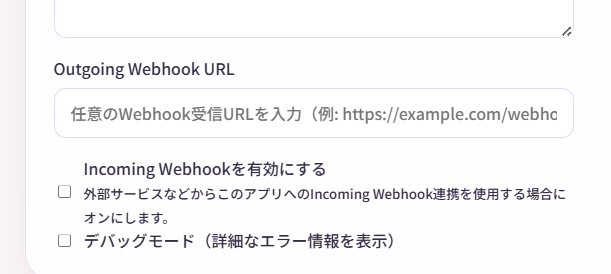
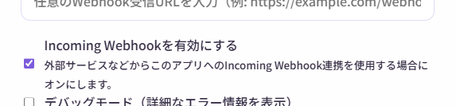

# Webhook連携

**Webhook**機能を使うと、Narrative Conversationを外部のツールやサービスと連携できます。

!!! warning "上級者向け機能"
    この機能は、プログラミングやAPI連携の知識がある方向けです。初心者の方は、まず基本機能をマスターしてからチャレンジしてください。

---

## Webhookとは？

**Webhook**は、アプリ間でデータをやり取りする仕組みです。

Narrative Conversationでは、2種類のWebhookが使えます：

1. **Outgoing Webhook** - 物語が再生されたら、外部に通知
2. **Incoming Webhook** - 外部から物語に介入

---

## Outgoing Webhook

物語のエントリが生成あるいはアニメーション再生されるたびに、指定したURLにデータを送信します。

### 用途例

- Discord、Slackに物語を自動投稿
- 外部データベースに保存
- 音声合成ツールで読み上げ
- 照明やガジェットを物語に連動

### 設定方法

1. 上部メニューから **「設定」**
2. **「Outgoing Webhook URL」** にURLを入力
3. 自動保存される



### 送信されるデータ

エントリが生成されると、以下のJSON形式でPOSTリクエストが送信されます：

```json
{
  "type": "dialogue",
  "name": "アリス",
  "content": "こんにちは！",
  "createdAt": "2025-01-01T12:00:00Z",
  "storyId": "story-abc123"
}
```

### Python受信サンプル

!!! warning "以下のコードは例示です。動作確認をしていません。"
    実際に使用する場合は、セキュリティやエラーハンドリングを十分に考慮してください。

Webhookを受信するシンプルなPythonサーバーの例：

```python
from flask import Flask, request, jsonify

app = Flask(__name__)

@app.route('/webhook', methods=['POST'])
def receive_webhook():
    """Narrative ConversationからのWebhookを受信"""
    try:
        data = request.json
        
        # 受信したデータを表示
        print("=" * 50)
        print(f"タイプ: {data.get('type')}")
        print(f"名前: {data.get('name', '(なし)')}")
        print(f"内容: {data.get('content')}")
        print(f"作成日時: {data.get('createdAt')}")
        print(f"物語ID: {data.get('storyId')}")
        print("=" * 50)
        
        # 必要に応じてここで処理を追加
        # - データベースに保存
        # - Discordに投稿
        # - 音声合成で読み上げ
        # など
        
        return jsonify({"status": "ok"}), 200
        
    except Exception as e:
        print(f"エラー: {e}")
        return jsonify({"status": "error", "message": str(e)}), 500

if __name__ == '__main__':
    # ポート5000で起動
    print("Webhook受信サーバーを起動中...")
    print("Narrative Conversationの設定で以下を入力してください:")
    print("  Webhook URL: http://127.0.0.1:5000/webhook")
    app.run(host='127.0.0.1', port=5000, debug=True)
```

**使い方：**

1. 上記コードを `webhook_receiver.py` として保存
2. Flaskをインストール：`pip install flask`
3. サーバーを起動：`python webhook_receiver.py`
4. Narrative Conversationの設定で、Webhook URLに `http://127.0.0.1:5000/webhook` を入力

---

## Incoming Webhook

外部から物語にエントリを追加できます。

### 用途例

- IoTデバイスからイベントを送信
- 外部スクリプトで物語を制御
- チャットボットとの連携

### 有効化方法

1. 上部メニューから **「設定」**
2. **「Incoming Webhookを有効にする」** にチェック
3. 自動保存される



### エンドポイント

有効化すると、以下のエンドポイントが利用可能になります：

```
POST http://127.0.0.1:8000/webhook
```

### 送信データ形式

以下のJSON形式でPOSTリクエストを送信します：

```json
{
  "type": "narration",
  "content": "突然、警報が鳴り響いた。",
  "name": null
}
```

| フィールド | 必須 | 説明 |
|-----------|------|------|
| `type` |  | エントリタイプ（dialogue, action, narration, direction, generate） |
| `content` |  | エントリの内容 |
| `name` |  | キャラクター名（dialogueとactionの場合） |

!!! tips "generateタイプ"
    - `type`に `generate` を指定すると、即座にAIに物語の続きを生成させることができます。
    - 例：`{"type": "generate", "content": "", "name": null}`
    - この際、設定にかかわらず確認ダイアログは表示されません。
    - ただし、競合やセッションロストの際は停止します。

### Pythonでの送信例

```python
import requests

url = "http://127.0.0.1:8000/webhook"
data = {
    "type": "narration",
    "content": "突然、大きな音が聞こえた。"
}

response = requests.post(url, json=data)
print(response.status_code)  # 200 なら成功
```

### curlでの送信例

```bash
curl -X POST http://127.0.0.1:8000/webhook \
  -H "Content-Type: application/json" \
  -d '{"type":"narration","content":"突然、大きな音が聞こえた。"}'
```

---

## JSON連動機能

**JSON連動**は、物語内にJSON形式のデータを埋め込んで、外部ツールに指示を送る機能です。

!!! warning "非常に高度な機能"
    この機能は、プログラミングと外部ツール開発の知識が必要です。

### 使い方

1. 上部メニューから **「設定」**
2. **「JSON定義」** に、JSONのスキーマ（仕様）を入力

**例：**
```
このJSONは照明制御に使われます。
color: ライトの色（red, blue, green, white）
brightness: 明るさ（0〜100）

例：
{"color": "red", "brightness": 80}
```

3. AIが物語内にJSONを生成します

**生成例：**
```xml
<narration>部屋が暗くなった。</narration>
<json>{"color": "blue", "brightness": 30}</json>
```

4. Outgoing Webhookで外部に送信され、ツールが反応します

### 用途例

- スマートライトを物語に連動
- ロボットを物語に合わせて動かす
- ゲームエンジンと連携
- IoTデバイスと連動

詳細は [JSON連動機能](json-actions.md) のページを参照してください。

---

## セキュリティ上の注意

### Incoming Webhookのリスク

Incoming Webhookを有効にすると、**ローカルネットワーク内の誰でも**物語にエントリを追加できます。

!!! danger "重要"
    - インターネットに公開しないでください
    - 信頼できるネットワークでのみ使用してください
    - 不要な時は無効化してください

### Outgoing Webhookのリスク

送信先URLが信頼できるサービスか確認してください。

- 物語の内容が外部に送信されます
- 機密情報を含む物語には使用しないでください

!!! danger "安全性に関する注意"
    外部ツールや外部機器の制御を伴うため、**安全性に十分注意してください。**

    - 信頼できるツールのみ使用してください。
    - 熱源や感電などの危険がある機器は特に注意してください。
    - 万が一の誤動作に備え、緊急停止手段を用意してください。
    
---

## トラブルシューティング

### Outgoing Webhookが動作しない

**確認事項：**

1. URLが正しいか（https:// または http://）
2. 送信先サービスが稼働しているか
3. ファイアウォールでブロックされていないか
4. タイムアウト設定が適切か（設定→通信タイムアウト）

### Incoming Webhookでエラーが出る

**確認事項：**

1. Incoming Webhookが有効になっているか
2. JSON形式が正しいか
3. `type`と`content`が含まれているか
4. サーバーが起動しているか

---

## よくある質問

### Q. Webhookは無料ですか？

**A.** Narrative Conversation自体は無料ですが、連携先のサービスによっては料金が発生する場合があります。

また、生成処理を実行することで、AIプロバイダの利用料金は別途発生します。

### Q. Webhookを使わなくても大丈夫ですか？

**A.** はい、Webhookは完全にオプションです。

基本的な物語作成には不要です。

### Q. 複数のWebhook URLを設定できますか？

**A.** 現在は1つのみです。

複数のサービスに送信したい場合は、中間サーバーを立てて転送する必要があります。

### Q. セキュリティは大丈夫ですか？

**A.** ローカルネットワーク内でのみ使用する限り、比較的安全です。

インターネットに公開するのは避けてください。

---

## まとめ

Webhook機能を使えば：

-  物語を外部ツールと連携
-  IoTデバイスと連動
-  自動化・拡張が可能

上級者向けですが、使いこなせば物語体験がさらに広がります！ 

---

## 次のステップ

- [JSON連動機能](json-actions.md) - さらに詳しいJSON連携
- [エクスポート機能](export.md) - 物語の保存・共有
