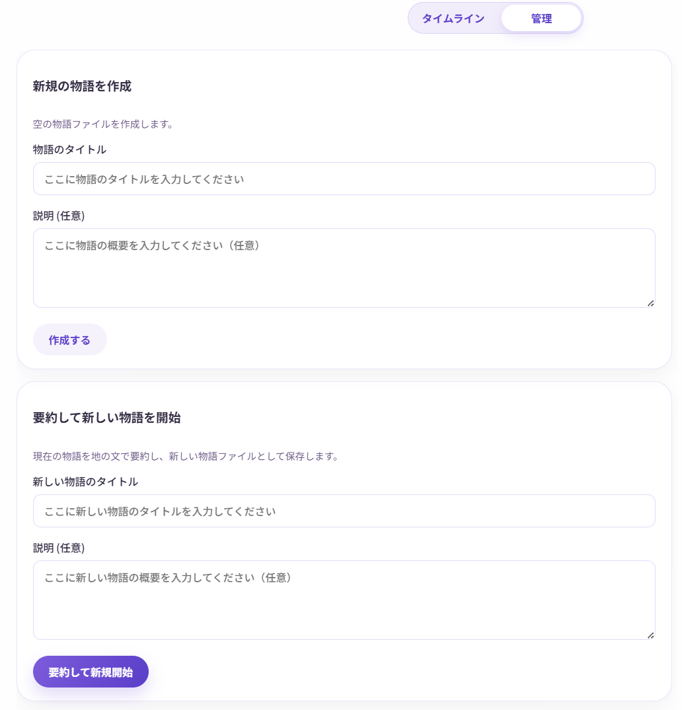

# 物語を作る

このページでは、Narrative Conversationで初めて物語を作る手順を、ステップバイステップで説明します。

## 物語作成の基本的な流れ

初期設定時に最初の物語ファイルは自動的に作成されています。以下の手順で物語を作っていきましょう。

1. 世界観を設定
2. キャラクターを作成
3. AIに物語を生成させる
4. 編集・分岐・保存

---

## ステップ1: 世界観を設定する

物語の舞台や設定を決めます。

### 1-1. 世界観ビューを開く

上部メニューから **「世界観」** をクリック


### 1-2. 世界観を入力

テキストエリアに、物語の世界観を自由に書きます。

**入力例：**

```
ここは「アルカディア魔法学園」。
世界各地から集まった才能ある魔法使いの卵たちが、
魔法の技術と知識を学ぶための学園です。

学園は緑豊かな丘の上に建ち、周囲は深い森に囲まれています。
生徒たちは寮で共同生活をしながら、
魔法の基礎理論から実践まで幅広く学びます。

時代設定は現代風ですが、魔法が日常的に使われている世界です。
```


!!! tip "世界観の書き方のコツ"
    - 箇条書きでもOK、自由な文章でもOK
    - 時代、場所、特徴的な要素を書く
    - 既存の小説やアニメの設定を参考にしてもOK
    - AIが理解しやすいよう、具体的に書く
    - YAMLやJSON形式で書くと、AIの注意が抜けにくく崩れにくいという説があります。

入力すると、右上に **「保存済み」** と表示されます（自動保存）。

---

## ステップ2: キャラクターを作成する

物語に登場するキャラクターを設定します。

### 2-1. 登場人物ビューを開く

上部メニューから **「登場人物」** をクリック

### 2-2. 新しいキャラクターを追加

1. **「新規追加」** ボタンをクリック
2. キャラクター情報を入力：

**入力例（主人公）：**

- **名前**: アリス
- **説明**:
  ```
  17歳の女子生徒。明るく前向きな性格で、友達思い。
  魔法の才能はそこそこだが、努力家で諦めない強さを持つ。
  火の魔法が得意。少しドジなところがある。
  ```


入力は自動で保存されます。

### 2-3. 複数のキャラクターを追加

同じ手順で、他のキャラクターも追加しましょう。

**入力例（友人キャラ）：**

- **名前**: ボブ
- **説明**:
  ```
  18歳の男子生徒。クールで理論的な性格。
  魔法理論に詳しく、成績優秀。
  氷の魔法が得意。アリスとは幼馴染。
  ```

!!! tip "キャラクター作成のコツ"
    - 最初は2〜3人から始めると管理しやすい
    - 性格、年齢、特技、関係性を書くと良い
    - 既存のキャラクターをテンプレートにしてもOK
    - あとから追加・編集もできます
    - YAMLやJSON形式で書くと、AIの注意が抜けにくく崩れにくいという説があります。

---

## ステップ3: AIに物語を生成させる

いよいよ、AIに物語を作ってもらいます！

### 3-1. メイン画面に戻る

上部メニューから **「メイン」** をクリック

### 3-2. 司令や地の文を入力

**「司令」** の入力欄に、AIへの指示を書きます。

**デフォルトの司令：**
```
次の1タグ分のみ生成してください
```

これは最小単位(1要素づつ)で物語を生成する司令です。  
これでもOKですが、一気に作ることもできます。(なお、一気に進めると結果的に料金も安くなります)

**指示の例：**

- 「物語を作成してください」
- 「アリスとボブが初めて出会うシーンを作ってください」
- 「授業中のシーンを作ってください」
- 「何か面白い事件を起こしてください」
- 「フラペチーノに興味を持たせてください」
- 「次の場面転換まで進行してください」
- 「次にダイスロールが必要な場面まで進めてください」


後に記載するように、地の文や指示、キャラクターの発言・行動も直接入力できます。  
あらかじめ入力しておくと、方向性が定まりやすくなります。

### 3-3. 生成ボタンをクリック

画面右下の **「続きを生成」** ボタン（青色の丸いボタン）をクリック


### 3-4. 確認ダイアログ

生成を開始すると料金が発生するため、生成前の確認画面が表示されます。  
(料金は、設定したAIモデルとトークン数に応じて決まりますが、多くの場合は1回あたり数円未満です)

進めてよければ、**「生成開始」** ボタンをクリックします。


!!! tip "確認をスキップする設定"
    毎回確認が面倒な場合は、「設定」→「生成前確認をスキップ」にチェックを入れると省略できます。

### 3-5. 生成を待つ

AIが物語を生成します。数秒〜数十秒かかります。

生成中は、画面に「生成中...」と表示されます。


### 3-6. 生成完了！

生成が完了すると、タイムラインに新しいエントリが追加されます。

アニメーション機能がオンの場合、文字が1文字ずつ表示されます。


---

## ステップ4: 物語を続ける

### 4-1. 続きを生成

同じように **「 生成」** ボタンをクリックすると、物語が続いていきます。

司令を変更することで、展開を変えることもできます：

- 「会話がたくさん起こるようにしてください」
- 「突然事件が起こる展開にしてください」
- 「場面を変えて、夜のシーンにしてください」

### 4-2. 自分で入力する

AIに任せるだけでなく、自分でエントリ(発言や行動)を追加することもできます。  
司令を「アリスのセリフと行動だけ作ってください」とすれば、あなたはボブになりきって一緒に物語を進めることもできます。

画面右下からエントリタイプを選択：

   - **発言（dialogue）**: キャラクターのセリフ
   - **行動（action）**: キャラクターの行動
   - **地の文（narration）**: 説明文
   - **指示（direction）**: 物語への介入


!!! tip "司令と指示の使い分け"
    - 司令は今現在の物語の作成ルールをAIに指示するものです。物語上に残りません。例:「次の場面まで作成してください」
    - 指示は物語の途中で特定の介入や指定をしたいときに使います。物語上に残ります。例:「ここで爆発が起こります」

3. キャラクター名（発言・行動の場合）と内容を入力
4. **「追加」** ボタンをクリック
5. 満足行くまで追加・編集したら、**「続きを生成」** ボタンをクリックして、物語を進めます。

---

## エントリの編集・削除

### エントリを編集する

1. タイムライン上のエントリをクリックし、編集を選択
2. 内容を修正
3. **「保存」** (キャラクターの場合は **行動として保存** または **発言として保存** ) または **「キャンセル」**

### エントリを削除する

1. エントリをクリック
2. **「削除」** ボタンをクリック
3. 確認ダイアログで **「削除」**

### エントリを挿入する

1. 挿入したい場所の直前のエントリをクリック
2. **前に挿入** または **「後に挿入」** を選択
3. 新しいエントリを作成

!!! tip "自由に編集できるのがこのアプリの強み"
    通常のAIチャットと違い、過去の内容を自由に編集・削除・挿入できます。納得いくまで物語を調整しましょう！

「これよりあとの項目を全て削除」や「ここから分岐して別の物語ファイルにブランチを作成」も可能です。

---

## 物語を保存する

**自動保存されます！**

Narrative Conversationでは、編集内容が自動的に保存されます。

- エントリを追加・編集すると、数秒後に自動保存
- 右上の「保存済み」表示で確認できる
- 手動で保存する必要はありません

---

## 物語をエクスポートする

作成した物語を、他の形式で保存できます。

### テキスト形式でエクスポート

1. 「物語」パネルの **「管理」** タブをクリック
2. **「エクスポート」** セクションで **「テキスト」** を選択
3. **「エクスポート」** ボタンをクリック
4. ブログやSNSに貼り付けやすいテキストが表示されます。コピーも可能です。

### XML形式でエクスポート

AIが理解しやすい形式で保存されます。上級者向け。

詳しくは [エクスポート機能](../advanced/export.md) を参照してください。

---

## 複数の物語を管理する

2回目以降、別の物語を作りたい場合は以下の手順で新規作成できます。

### 新しい物語を作成する

1. **「物語」** パネルの右側にある **「管理」** タブをクリック
2. **「新規の物語を作成」** セクションで以下を入力：
   - **物語のタイトル**: 例）「SF宇宙戦記」
   - **説明（任意）**: 例）「宇宙を舞台にしたSF物語」
3. **「作成する」** ボタンをクリック
4. **「タイムライン」** タブをクリックして、物語の表示画面に戻ります。

!!! success "作成完了"
    「物語ファイル」のドロップダウンに、作成した物語が表示されます。

!!! tips "物語が長くなってきて、生成時間やコストが気になる場合"
    「要約して新しい物語を開始」を使うと、現在の物語を要約して続きの物語を始められます。  
    要約の際の条件などは、応用的な設定画面の**「要約設定(システムプロンプト)」**で調整できます。



### 物語を切り替える

「物語ファイル」のドロップダウンから、別の物語を選択できます。

### 物語を削除する

「管理」タブの「削除」セクションから、不要な物語を削除できます。

!!! warning "削除は画面上からは元に戻せません"
    画面操作での復元はできませんが、以下を試してください：  
    backupsフォルダ内のstoriesに30世代までのバックアップが保存されています。  
    これをメモ帳などのテキストエディタで開き、dataフォルダ内の物語ファイルに上書きすることで、復元できる可能性があります。

---

## 次のステップ

基本的な使い方をマスターしたら、以下もお試しください：

- **[物語の編集と分岐](../advanced/editing-branching.md)** - 高度な編集テクニック

---

## よくある質問

### Q. AIが思ったような展開にしてくれない

**A.** 「司令」で具体的に指示してみましょう。

例：

-  「続きを書いて」
-  「アリスが魔法を失敗して、爆発を起こすシーンを書いて」

### Q. キャラクターの口調がおかしい

**A.** キャラクター説明に、口調や話し方を追加しましょう。

例：
```
丁寧語で話す。「〜ですわ」「〜ませんの」といった口調を使う。
```

### Q. 生成に時間がかかる

**A.** 以下を確認してください：

- ネットワーク速度が遅い
- 使っているAIモデルが重い
- トークン数が多すぎる（設定で最大トークン数を調整）

### Q. 料金が心配

**A.** 画面下部に推定コストが表示されます。

- まずは無料モデルで試す
- トークン単価の安いモデルを選ぶ
- 生成回数を控えめにする

---

さあ、あなただけの物語を作り始めましょう！ 
