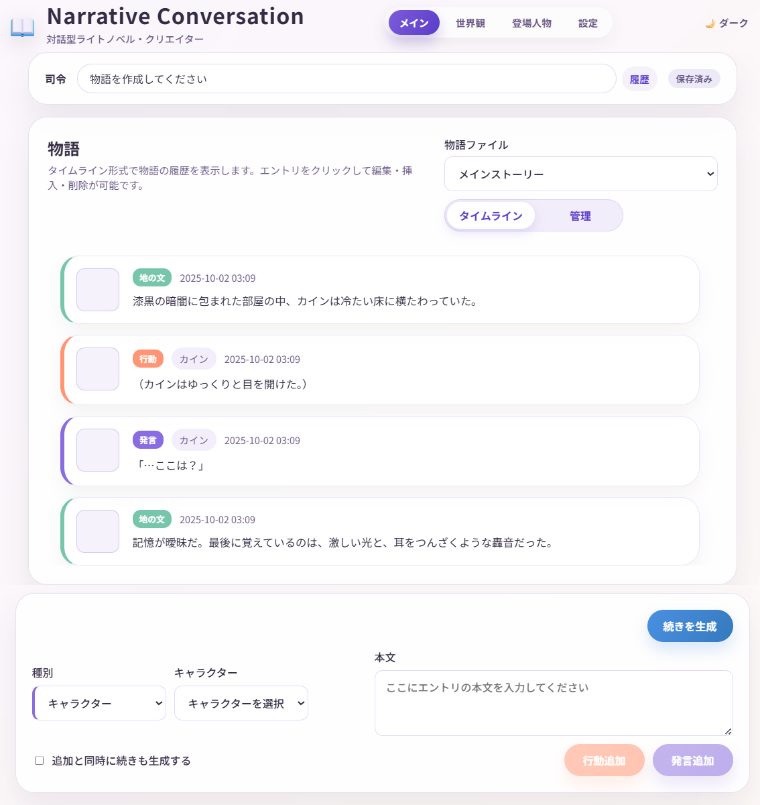
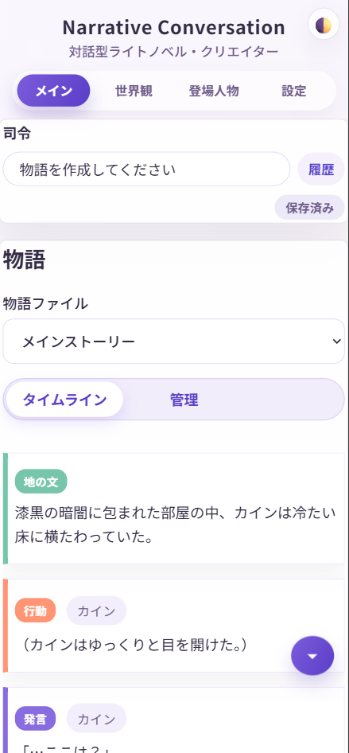

# Narrative Conversation へようこそ

**Narrative Conversation** は、AIを使って自由に物語を作ったり、キャラクターになりきって会話したり、ゲームブックのように遊んだりできるアプリケーションです。

## このアプリでできること

- **物語の生成**: AIがあなたの指示に従って、魅力的な物語を自動で紡いでいくれます
- **キャラクターとの対話**: 設定したキャラクターと会話するように物語を進められます
- **自由な編集**: 物語の途中を編集したり、分岐させたり、差し替えたりが簡単にできます
- **ゲームブック風に遊ぶ**: ダイスロール機能を使ってTRPG風に楽しめます
- **様々なスタイル**: ライトノベル風、TRPG風など、好みのスタイルで物語を作れます
- **どこでも操作可能**: パソコンで動かしながら、スマホ・タブレットからも操作できます

!!! tip "自由な場所で楽しめる"
    このアプリはサーバーとしてパソコンが必要ですが、ブラウザベースなので**スマートフォンやタブレットからもアクセス可能**です。
    
    - ソファでくつろぎながら
    - ベッドの上で寝転びながら
    - カフェでタブレットを使って
    - 通勤中にスマホで続きを読む
    
    パソコンを起動しておけば、家中どこからでも、[Tailscaleを使えば外出先からでも](setup/remote-access.md)、自由に物語を楽しめます。  
    重い処理はしませんので、中古屋さんの安いノートPCでも十分に動作します。

## こんな人におすすめ

- **物語を書くのが好きな人**: AIがアイデアを広げてくれるので、創作がもっと楽しくなります
- **TRPG・ゲームブックが好きな人**: 一人でもTRPG風の体験が楽しめます
- **キャラクターと会話したい人**: 自分で設定したキャラクターと対話できます
- **AIチャットに物足りなさを感じている人**: 通常のAIチャットではできない細かい編集や分岐が可能です
- **好きな場所で読書したい人**: スマホやタブレットで、ベッドやソファから快適にアクセス

## 一般的なAIチャットとの違い

通常のAIチャットアプリと違い、Narrative Conversationには次のような特徴があります：

| 機能 | 一般的なAIチャット | Narrative Conversation |
|------|------------------|----------------------|
| AIモデルの選択 | 決められた選択肢 | OpenRouter (ChatGPT, Claude, Gemini, xAI...), LM Studio、Ollamaなど複数対応 |
| 過去の発言の編集 | 制限付き | 1発言単位で簡単に編集・差し替え・削除できる |
| 物語の分岐 | 制限付き | 任意の場所から分岐可能 |
| 細かい設定管理 | プロンプトが必要 | 世界観やキャラクターを個別に管理 |
| データの保存形式 | サービス依存 | テキストファイルで自由に管理 |
| アニメーション表示 | なし | ゲーム風の演出が可能 |
| マルチデバイス対応 | アカウント連携が必要 | PC・スマホ・タブレットで自由にアクセス |

## 使用前の重要な注意事項

!!! warning "必ずお読みください"
    このアプリを使うには、**自分でAIサービスと契約してAPIキーを取得する必要があります**。アプリ自体は無料ですが、AIサービスの利用には料金がかかります。  
    また、AIサービスのような安全機構(ガードレール)はありません。生成される内容には、誤情報や不適切な内容が含まれる可能性があります。  
    生成されたコンテンツの使用はあなたの責任あり、プロバイダーの利用規約を守るのもあなたの責任です。

### AIサービスについて

- このアプリには**AI機能は含まれていません**
- OpenRouter、LM Studio、Ollamaなど、**外部のAIサービス**を使います
- AIサービスの利用料金は、あなたが直接支払います
- **OpenRouter**なら無料枠があるので、まずはこれから始めるのがおすすめです
- 自分のPCでAIを動かす [ローカルLLM](advanced/local-llm.md) も使えます（上級者向け）

### 安全性について

- 一般的なAIサービスのような**安全機構（有害コンテンツのフィルタリング）はありません**
- AIが生成する内容には、予測できない情報、誤った情報、不適切な内容が含まれる可能性があります
- **生成されたコンテンツの使用はあなたの責任です**
- 未成年者の利用は推奨しません。プロバイダーの利用規約をご参照ください。

!!! info "AI利用の基礎知識"
    AIの使い方や注意点について詳しく知りたい方は、総務省の資料をご覧ください：  
    [生成AIはじめの一歩～生成AIの入門的な使い方と注意点～](https://www.soumu.go.jp/use_the_internet_wisely/special/generativeai/)

!!! danger "重要"
    - 本アプリケーションはLAN内での使用が前提です。インターネットに公開しないでください
    - 信頼できるネットワークでのみ使用してください
    - 不要な時は停止してください
    - ネットカフェなど不特定多数が利用するネットワークでは使用しないか、ファイアーウォールでアクセスを制限してください

## 次のステップ

まずは以下の順番で進めていくと、スムーズに使い始められます：

### 基本ステップ（必須）

1. **[インストール](setup/installation.md)** - アプリをパソコンにインストール
2. **[初期設定](setup/initial-setup.md)** - AIサービスとの接続設定
3. **[物語を作る](guide/basic-story.md)** - 実際に物語を作ってみる

### オプション（必要に応じて）

- **[外出先からアクセス](setup/remote-access.md)** - スマホやタブレットから使う方法
- **[用語集](glossary.md)** - 「LLM」「API」など、よく出てくる言葉の意味を確認
- **[ローカルLLMを使う](advanced/local-llm.md)** - 自分のPCでAIを動かす方法（上級者向け）

!!! tip "困ったときは"
    [よくある質問（FAQ）](troubleshooting/faq.md)のページもご覧ください。

## ライセンスと著作権

このアプリはMITライセンスで公開されています。無料で自由に使えます。

- **アプリ自体の著作権**: 開発者（gpsnmeajp）に帰属します
- **あなたが作った物語の著作権**: あなたに帰属します
- ただし、AIが生成した内容が意図せず他者の著作権を侵害している可能性もあります。公開する際はご注意ください

# スクリーンショット

 