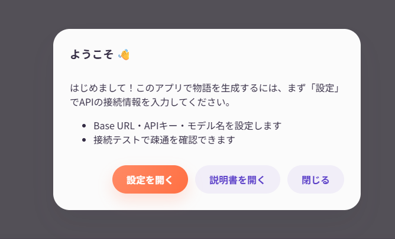
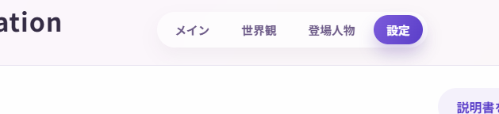
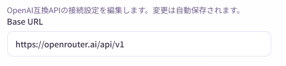
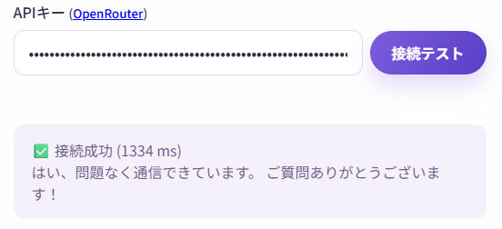
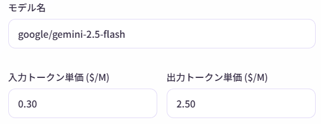
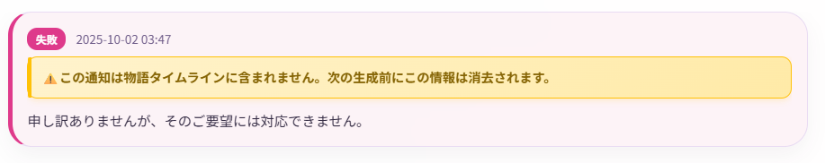
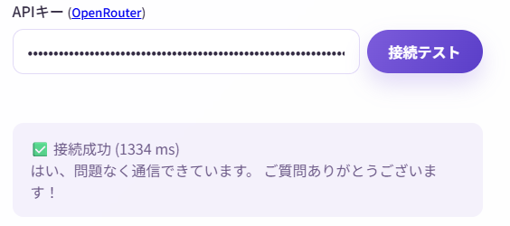
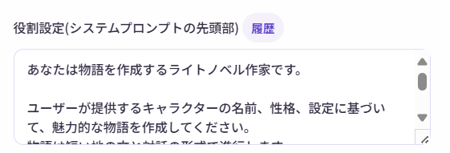
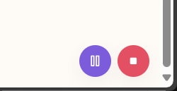
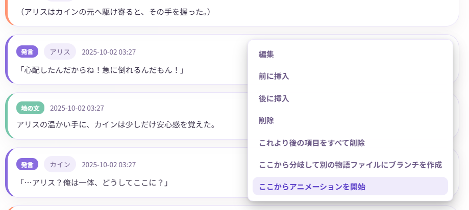

# 初期設定

このページでは、Narrative Conversationを初めて使う時の設定方法を、画像付きでわかりやすく説明します。

## 設定の流れ

初期設定は、以下の3つのステップで完了します：

1. **AIサービスを選ぶ** - どのAIサービスを使うか決める
2. **APIキーを取得する** - 選んだAIサービスでアカウントを作成
3. **アプリで接続設定** - 取得したAPIキーを入力して接続テスト

!!! info "所要時間"
    約10〜15分で完了します。

---

## ステップ1: AIサービスを選ぶ

Narrative Conversationは、複数のAIサービスに対応しています。初心者には**OpenRouter**がおすすめです。

### 推奨: OpenRouter（初心者向け）

**おすすめする理由：**

- **有名サービス** - AI業界で広く使われている信頼性の高いサービス
- **有名なモデルが揃っている** - GPT、Claude、Geminiなど、人気のAIモデル提供会社と連携
- **オープンモデルが使える** - ローカルLLMで同じように使えるオープンモデルが使える
- **無料枠がある** - 最初は課金なしで試せる
- **前払い式** - 利用枠を追加して使う方式で、使いすぎを防げる
- **使った分だけ課金** - 月額料金ではなく、使用量に応じた料金。

**公式サイト**: [https://openrouter.ai/](https://openrouter.ai/)

※無料枠を超える利用にはクレジットカードの登録が必要な点にご注意ください。  
 本ページでは解説しませんが、無料にこだわる場合はGeminiの方が無料枠が広いようです。

!!! warning "重要"
    どのAIサービスを使う場合でも、無料枠や無料モデルは入出力が記録・分析される規約になっています。  
    プライバシーを重視する場合は、有料モデルを使うか、ローカルLLMを検討してください。  
    (有料と言っても、1回の生成につき数円未満の場合が多いです)

    情報収集は、OpenRouterの[プライバシー設定](https://openrouter.ai/settings/privacy)で調整できますが、オフにすると無料モデルは使用できなくなります。

!!! tip "より詳しい説明"
    OpenRouterの詳しい登録手順や、その他のAIサービスの設定方法は、以下をご覧ください：
    

    - [ローカルLLMを使う](../advanced/local-llm.md) - 自分のPCでAIを動かす方法

### その他の選択肢

| サービス | 特徴 | 難易度 | 費用 |
|---------|------|--------|------|
| **LM Studio** | 自分のPCでAIを動かす | 上級者向け | 無料（高性能PCが必要） |
| **Ollama** | LM Studioと同様 | 上級者向け | 無料（高性能PCが必要） |
| **Gemini** | Googleが提供 | 中級者向け | 有料 |
| **Claude** | Anthropicが提供 | 中級者向け | 有料 |

!!! info "このガイドでは"
    以降の説明では、初心者に最も推奨される**OpenRouter**を使う前提で進めます。

---

## ステップ2: OpenRouterでAPIキーを取得

OpenRouterでアカウントを作成し、APIキーを取得します。

### 簡単な手順

1. [OpenRouterの公式サイト](https://openrouter.ai/)にアクセス
2. 右上の「Sign Up」ボタンからアカウント登録（Google/GitHub/メールアドレス）
3. ログイン後、Settings → Keys → 「Create Key」でAPIキーを作成
4. 表示されたAPIキーを**必ずコピーして保存**

!!! warning "重要：APIキーは一度しか表示されません"
    APIキーは作成時に一度だけ表示されます。消えた場合は、新しいキーを作り直す必要があります。  
    ※何度でも何回でも無料でキーは作り直せるので、軽率に作り直してOKです。

    **APIキーは絶対に他人に教えないでください。** 悪用されて料金が発生する可能性があります。

!!! tip "詳しい登録手順を見たい方へ"
    こちらのサイトがおすすめです。
    + [【画像付き】OpenRouterのAPIキー取得・支払い方法・使い方](https://eiji.page/blog/openrouter-get-api-key/)
    + [【LLMは無料で使え！】OpenRouterのススメ【CLINEにも！】](https://zenn.dev/asap/articles/5cda4576fbe7cb)

### クレジットの追加（任意）

OpenRouterには無料枠がありますが、使い切った場合に備えてクレジットを追加できます。  
Settings → Credits → 「Add Credits」から、$10程度を追加すると、無料枠も広がります。

---

## ステップ3: Narrative Conversationで接続設定

### 3-1. 設定画面を開く

1. Narrative Conversationを起動
2. ポップアップから設定画面を選択 (2回目以降は、画面上部のメニューから「設定」をクリック)





### 3-2. API設定を入力

「API設定」セクションで、以下の3つを入力します：

#### (1) Base URL

OpenRouterの場合は、以下を入力(最初から入力されています)：

```
https://openrouter.ai/api/v1
```



!!! tip "他のサービスを使う場合"
    - **LM Studio**: `http://127.0.0.1:1234/v1`
    - **Ollama**: `http://127.0.0.1:11434/v1`
    - **OpenAI**: `https://api.openai.com/v1`
    - **Gemini**: `https://generativelanguage.googleapis.com/v1beta/openai/`
    - **Claude**: `https://api.anthropic.com/v1`

#### (2) APIキー

ステップ2-2で取得したAPIキーを貼り付けます。

- 先頭や末尾にスペースが入らないように注意
- コピー＆ペーストで正確に入力



#### (3) モデル名

使いたいAIモデルを指定します。



**OpenRouterでおすすめのモデル：**

動作確認済みのモデルを以下に示します。

無料モデルは、入力された情報を収集し、訓練に使ったり研究機関に提供します。(その対価として無料で利用できます)  
情報収集は、OpenRouterの[プライバシー設定](https://openrouter.ai/settings/privacy)で調整できますが、オフにすると無料モデルは使用できなくなります。  
(逆に有料モデルで情報収集を許可すると割引もあります。)

| モデル名 | 入力料金 | 出力料金 | 特徴 | プライバシー |
|---------|------|----------|------|------------|
| `z-ai/glm-4.5-air:free` | 無料 | 無料 | 比較的創作の自由度が高く創作能力も良い、性能を期待しすぎないこと。 | ⚠️ ログ収集あり |
| `openai/gpt-oss-20b:free` | 無料 | 無料 | 一般PCでもギリ動くが性能悪いし表現自由度は低め | ⚠️ ログ収集あり |
| `cognitivecomputations/dolphin-mistral-24b-venice-edition:free` | 無料 | 無料 | 比較的創作の表現自由度は高め | ⚠️ ログ収集あり |
| `qwen/qwen3-235b-a22b:free` | 無料 | 無料 | ローカルLLMの定番だが創作には不向き | ⚠️ ログ収集あり |
| `google/gemini-2.5-flash` | $0.30/M input tokens | $2.50/M output tokens | 創作能力はかなり高めだが表現自由度は微妙 | ✅ プライバシー保護 |
| `google/gemini-2.5-pro` | Starting at $1.25/M input tokens | Starting at **$10/M** output tokens | 創作能力は最高クラスだが表現自由度は微妙(そして高価) | ✅ プライバシー保護 |
| `openai/gpt-5` | $1.25/M input tokens | $10/M output tokens | 最新のGPTモデル(そして高価) | ✅ プライバシー保護 |
| `openai/gpt-4o` | Starting at $2.50/M input tokens | Starting at **$10/M** output tokens | みんな大好きGPT-4o(そしてめちゃ高価) | ✅ プライバシー保護 |
| `openai/gpt-4.1` | Starting at $2/M input tokens | Starting at **$8/M** output tokens | コスパの良いGPT(そして高価) | ✅ プライバシー保護 |
| `qwen/qwen3-235b-a22b-2507` | $0.08/M input tokens | $0.55/M output tokens | ローカルLLMの定番だが創作にはそこそこ。そして激安。 | ✅ プライバシー保護 |
| `z-ai/glm-4.5` | $0.38/M input tokens | $1.60/M output tokens | 比較的創作の表現自由度が高く創作能力も良いが、低速。 | ✅ プライバシー保護 |
| `z-ai/glm-4.5-air` | $0.14/M input tokens | $0.86/M output tokens | 比較的創作の表現自由度が高く創作能力も良いが、性能を期待しすぎないこと。 | ✅ プライバシー保護 |
| `anthropic/claude-sonnet-4` | Starting at **$3/M** input tokens | Starting at **$15/M** output tokens | 創作能力はかなり高めだが高価 | ✅ プライバシー保護 |
| `anthropic/claude-opus-4` | **$15/M** input tokens | **$75/M** output tokens | 創作能力は最高クラスだが超高額なのでまったくおすすめしません！すぐにクレジットが空になります！ | ✅ プライバシー保護 |

!!! tips "M Tokensとは？"
    - 日本語は1文字が1トークンに近い。英語は単語に近い。
    - 例: 「こんにちは」は5トークン、「Hello」は1トークンに相当したりする。
    - 1M Tokensは約100万文字（日本語の場合）
    - つまり、$1/M input tokensは、約100万文字の入力で1ドルかかる計算。

!!! tips "Starting atとは？"
    料金が使用量に応じて変動することを意味します。たいてい、一定量を超えると2倍とかの値段になります。要注意です。  
    OpenRouterの[Models](https://openrouter.ai/models)ページで、各モデルの料金体系を確認できます。

!!! question "「創作の表現自由度が低い」とは？"
    API利用でも、限定的ながらガードレールは存在しますし、言語モデル自体に拒否能力があります。  
    そのため、特定の表現ができなかったり、特定の話題を避けたりすることがあります。  
    (これは本アプリケーションの仕様ではなく、言語モデルやAPIサービス側の仕様です)

    + 自由度が高いモデルでも、何でも許されるわけではありません。(露骨な表現はNGになる場合が多いです)
    + これを回避しようとする試みはAPI利用規約違反になる場合があります。
    + ローカルLLMでも、同様に拒否が発生する場合があります。

    

### 3-3. 接続テスト

設定が完了したら、正しく接続できるか確認しましょう。

「接続テスト」ボタンをクリック



数秒待つと、結果が表示されます

**成功の場合：**

```
接続成功 (1234 ms)
はい、正常に通信できています。
```

このように表示されれば、設定完了です。

**失敗の場合：**

```
接続失敗
Error: 401 Unauthorized
```

エラーメッセージが表示された場合は、[よくあるエラーと対処法](#よくあるエラーと対処法)を参照してください。

---

## その他の設定（任意）

基本的な接続設定が完了したら、以下の項目も調整できます。

### トークン単価の設定

料金を正確に計算したい場合に設定します。

- **入力トークン単価 ($/M)**: 1百万トークンあたりの入力料金
- **出力トークン単価 ($/M)**: 1百万トークンあたりの出力料金

OpenRouterの [Models](https://openrouter.ai/models) ページで、各モデルの料金を確認できます。

!!! tip
    設定しなくても使えますが、設定しておくと画面下部に推定コストが表示されて便利です。
    

### 役割設定（システムプロンプト）

AIの「役割」を設定します。デフォルトでは以下のようになっています：

```
あなたは物語を作成するライトノベル作家です。

ユーザーが提供するキャラクターの名前、性格、設定に基づいて、魅力的な物語を作成してください。
物語は短い地の文と対話の形式で進行します。

世界観やキャラクター情報を参照し、物語の続きを作成してください。
```

変更例：

- 「あなたはTRPGのゲームマスターです。」
- 「あなたは冷静で論理的な小説家です。」
- 「あなたはユーモアあふれる物語を書く作家です。」

この設定によって、AIの文体や物語の進め方が変わります。  
年齢制限や暴力的な内容を含めたい、あるいは避けたい場合は、その旨を明記してください。



### アニメーション設定

- **アニメーションを有効にする**: 文字送り効果のオン/オフ
- **キャラクターアイコンを非表示にする**: アイコンを表示しない
- **生成前の確認画面をスキップする**: 生成前の確認ダイアログを表示しない

お好みで調整してください。

アニメーションの再生中は、右下に操作ボタンが表示されます。



なお、アニメーションは、生成直後には自動で開始しますし、好きなエントリからも再生できます。



---

## よくあるエラーと対処法

??? question "「接続失敗: 401 Unauthorized」"
    **原因**: APIキーが間違っているか、無効です。

    **対処法**:
    
    1. APIキーを再確認（コピーミスがないか）
    2. OpenRouterでAPIキーが有効か確認
    3. 必要に応じて新しいAPIキーを作成

??? question "「接続失敗: 404 Not Found」"
    **原因**: Base URLが間違っています。

    **対処法**:
    
    - Base URLを再確認（`https://openrouter.ai/api/v1`）
    - 末尾のスラッシュ `/` があるか確認

??? question "「接続失敗: Network Error」"
    **原因**: インターネット接続に問題があります。

    **対処法**:
    
    1. インターネット接続を確認
    2. ファイアウォールやセキュリティソフトを一時的に無効化
    3. VPNを使用している場合は、オフにしてみる

??? question "「接続失敗: Model not found」"
    **原因**: モデル名が間違っているか、そのモデルが利用不可です。

    **対処法**:
    
    1. モデル名を再確認（大文字小文字も正確に）
    2. OpenRouterの [Models](https://openrouter.ai/models) ページで利用可能なモデルを確認
    3. デフォルトのモデルに戻してみる

---

## 設定の保存について

Narrative Conversationでは、入力した設定は**自動的に保存**されます。

- 設定を変更すると、右上に「保存済み」と表示されます
- 次回起動時も、同じ設定が引き継がれます
- 設定ファイルは、dataフォルダに保存されます

---

## 次のステップ

設定が完了したら、実際に物語を作ってみましょう！

次は [物語を作る](../guide/basic-story.md) のページに進んでください。

---

## 困ったときは

それでもうまくいかない場合は、以下を参照してください：

- [よくある質問](../troubleshooting/faq.md)

