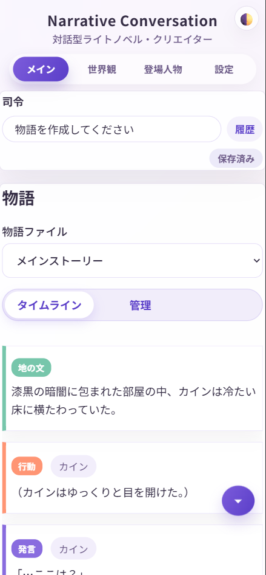

# 外出先からアクセスする（Tailscale）

このページでは、**Tailscale**を使って、外出先のスマートフォンやタブレットからNarrative Conversationにアクセスする方法を説明します。

!!! info "中級者向け"
    この機能は、ネットワークの基礎知識がある方向けです。基本的な使い方をマスターしてから挑戦することをおすすめします。

---

## Tailscaleとは？

**Tailscale**は、自分のデバイス同士を安全に接続できる無料のVPNサービスです。  
家の外でも、まるで同じWi-Fiに接続しているかのように、パソコンやスマホから自宅のPCにアクセスできます。

### 通常のアクセス方法の問題

Narrative Conversationは通常、`http://127.0.0.1:8000`（ローカルホスト）でアクセスします。これは「自分のパソコン内でアクセスする」方法です。

**問題点：**

-  外出先からアクセスできない
-  スマートフォンからアクセスできない
-  他のデバイスから見られない

### Tailscaleを使うメリット

Tailscaleを使うと、以下が可能になります：

-  **外出先から安全にアクセス** - カフェ、電車、旅行先など、どこからでも
-  **スマートフォン・タブレットで閲覧** - ブラウザで快適に読める
-  **複数デバイスで共有** - 自宅のPCで動かし、スマホで操作
-  **セキュア** - 暗号化された安全な接続
-  **無料** - 個人利用なら無料
-  **設定が簡単** - 難しいポート開放やルーター設定は不要

!!! success "おすすめのシーン"
    - 通勤・通学中にスマホで物語を読みたい
    - カフェでタブレットから物語を編集したい
    - 寝る前にベッドでスマホから読みたい
    - 友達と一緒に物語を作りたい

---

## 利用の前提条件

### 必要なもの

1. **Narrative Conversationが動作するPC**（自宅など）  
   ・Windows、Linux、macOSのパソコン  
   ・常時起動しておく、またはアクセス時に起動  

2. **アクセスするデバイス**  
   ・ スマートフォン（iPhone/Android）  
   ・ タブレット  
   ・ 別のPC  

3. **Tailscaleアカウント**（無料）

---

## セットアップ手順

### ステップ1: Tailscaleアカウントを作成

1. [Tailscale公式サイト](https://tailscale.com/)にアクセス
2. **「Get Started」** をクリック
3. Google、GitHub、Microsoft、Appleなどのアカウントでサインアップ

---

### ステップ2: PC（サーバー側）にTailscaleをインストール

#### Windows

1. [Tailscale Downloadページ](https://tailscale.com/download)にアクセス
2. **「Download for Windows」** をクリック
3. インストーラーをダウンロードして実行
4. インストール完了後、Tailscaleが自動起動
5. サインインを求められたら、ステップ1で作成したアカウントでログイン

#### Linux（Ubuntu/Debian）/ macOS

ご自身で公式ドキュメントを参照してください

---

### ステップ3: TailscaleのIPアドレスを確認

PCにTailscaleがインストールされると、専用のIPアドレスが割り当てられます。

#### Windowsの場合

1. タスクトレイのTailscaleアイコンをクリック
2. 自分のデバイス名をクリック
3. **「Copy IP address」** をクリック

表示されるIPアドレスは `100.x.x.x` のような形式です。

例：`100.xxx.xxx.xxx`

出力されたIPアドレスをメモします。

---

### ステップ4: Narrative Conversationを起動（外部アクセス許可）

通常、Narrative Conversationは ネットワーク内すべてのデバイスからアクセスできるように設定されています。  
アクセスできない場合は、ファイアーウォールの設定を確認してください。

```
INFO:     Uvicorn running on http://0.0.0.0:8000 (Press CTRL+C to quit)
```

---

### ステップ5: スマートフォン・タブレットにTailscaleをインストール

#### iPhone/iPad

1. App Storeで **「Tailscale」** を検索
2. インストール
3. アプリを開いて、同じアカウントでログイン

#### Android

1. Google Playで **「Tailscale」** を検索
2. インストール
3. アプリを開いて、同じアカウントでログイン

---

### ステップ6: スマートフォンからアクセス

1. スマートフォンのTailscaleアプリで接続スイッチをオン
2. ブラウザ（Safari、Chrome）を開く
3. アドレスバーに先にメモしたアドレスを入力：

```
例: http://100.xxx.xxx.xxx:8000
```

（`100.xxx.xxx.xxx` は、ステップ3で確認したPCのTailscale IPアドレス）

Narrative Conversationの画面が表示される！



---

## 使い方のヒント

### 自宅PCを常時起動

外出先からアクセスするには、自宅のPCが起動している必要があります。

**おすすめ設定：**
- スリープ設定を「なし」にする
- 電源オプションで「スリープしない」に設定
- または、Wake on LAN（WOL）を設定して遠隔起動

### ブックマークに追加

スマートフォンのブラウザで、TailscaleのIPアドレス（`http://100.x.x.x:8000`）をブックマークしておくと便利です。

### オフライン時の注意

- PC側のNarrative Conversationが起動していないと、アクセスできません
- PC側のTailscaleが起動していないと、アクセスできません
- スマホ側のTailscaleが接続されていないと、アクセスできません

### レスポンシブデザイン

Narrative Conversationはレスポンシブデザインに対応しているため、スマートフォンでも快適に操作できます。

- タイムラインは縦スクロールで読みやすい
- メニューはハンバーガーメニューで展開
- タップで編集可能

---

## セキュリティとプライバシー

### インターネットに公開されない？

 **公開されません。**

- Tailscaleネットワークは、自分のアカウントのデバイスだけ
- 外部からは一切アクセスできない
- ポート開放やルーター設定は不要

### 誰かに見られる心配は？

 **自分のデバイスだけです。**

- Tailscaleにログインしたデバイスだけがアクセス可能

---

## トラブルシューティング

### Q. スマホからアクセスできません

**確認事項：**

1. PC側のTailscaleが起動しているか
2. PC側のNarrative Conversationが `--host 0.0.0.0` で起動しているか
3. スマホのTailscaleアプリで接続がオンになっているか
4. IPアドレスが正しいか（`100.x.x.x`）
5. ポート番号が正しいか（`:8000`）

### Q. 接続が遅い

**原因と対処：**

- **PC側のネットワークが遅い**: 自宅のWi-Fiを確認
- **スマホ側のネットワークが遅い**: モバイルデータやWi-Fiを確認
- **P2P接続が確立していない**: しばらく待つと改善することがある

### Q. IPアドレスが変わってしまった

**A.** TailscaleのIPアドレスは基本的に固定ですが、まれに変わることがあります。

変わった場合は、再度確認して、ブックマークを更新してください。

### Q. PCをスリープから復帰させたい

**A.** Wake on LAN（WOL）を設定すれば、遠隔からPCを起動できます。

ただし、これは高度な設定なので、詳しくは別途調べてください。

---

## 参考リンク

- [Tailscale公式サイト](https://tailscale.com/)
- [Tailscaleドキュメント](https://tailscale.com/kb/)
- [Tailscale Download](https://tailscale.com/download)

---

## 次のステップ

- [物語を作る](../guide/basic-story.md) - 基本的な使い方
- [エクスポート機能](../advanced/export.md) - スマホで読んだ物語を保存
